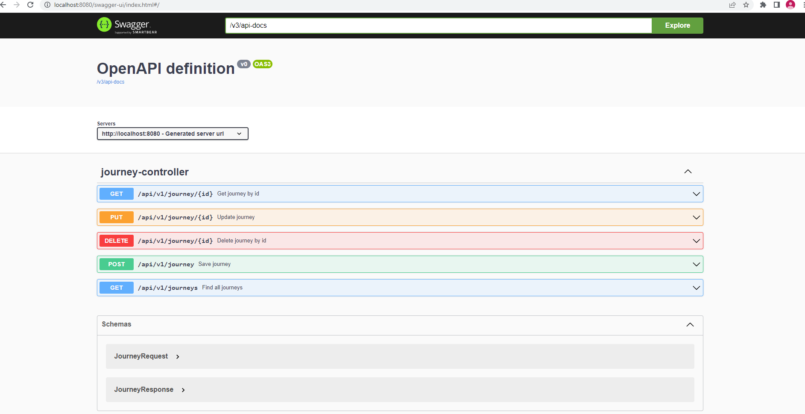
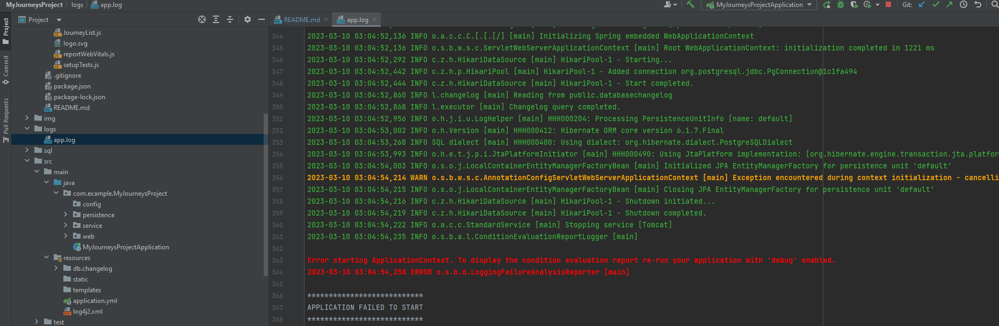

**Project:** travel list management.

**About the project:** User can perform CRUD operations (create, read, update and delete), when planning trips.

User can view all his travels.

User can create a new trip.

Edit an existing trip.

And delete trip.

The project uses the following technologies:
1. **React** - creating a custom part of the application (frontend). This react-application is located here: https://github.com/mista1984gmail/MyJourneysProjectApp
2. **SpringBoot** - creating a backend part of the application.
3. **Docker** -  for application deployment PostgreSQL, to work with the database, automatic initialization of the database.
4. **Swagger** - for documenting application endpoints.

5. **Liquibase** - to track, manage, and enforce database schema changes.
6. **Mapstruct** - to generate code for passing data between different entities in the program. It helps to map objects from one entity to another.
7. **Log4j2** - is responsible for writing information to log files based on the specified logging levels. The main task of the logger is not to miss the event that needs to be written to the log file.
