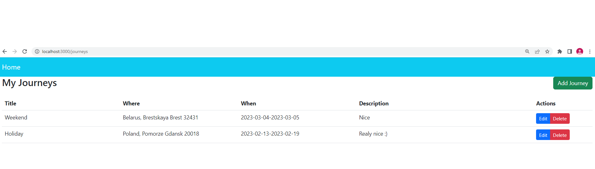
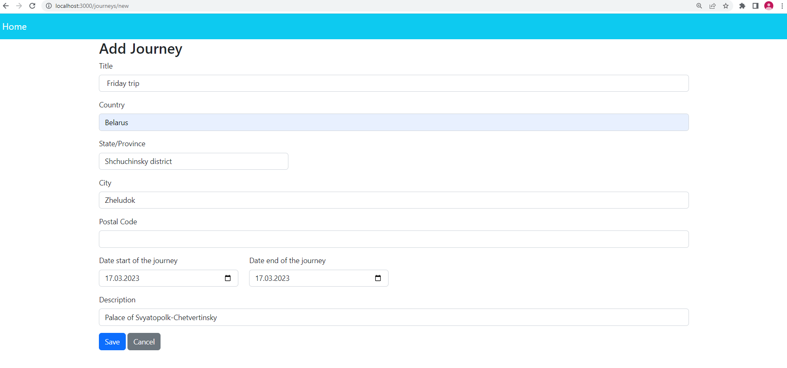
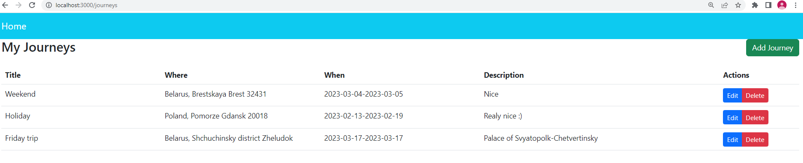
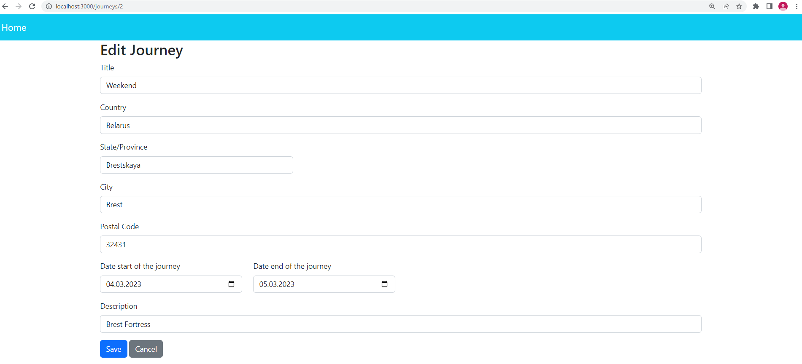
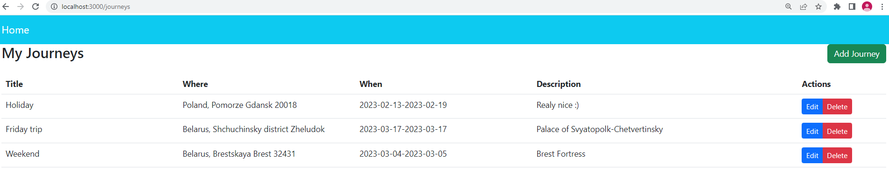
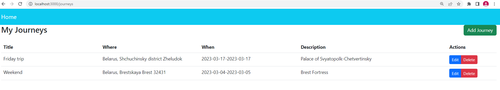

**Project:** travel list management.

**About the project:** User can perform CRUD operations (create, read, update and delete), when planning trips.

User can view all his travels.

User can create a new trip

Edit an existing trip.

And delete trip.
